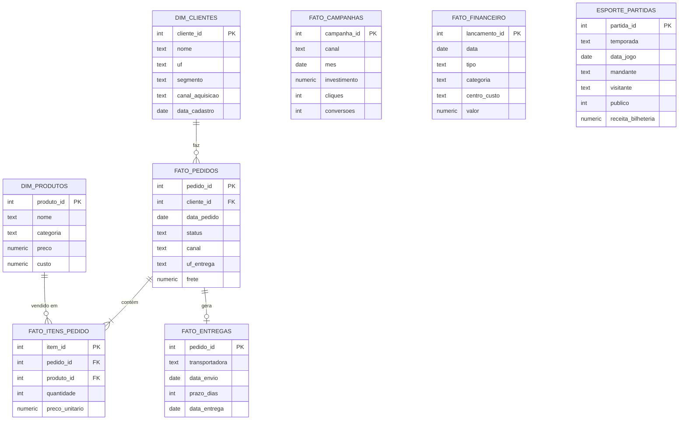

# Diagrama ER do banco de análise

```mermaid
erDiagram
  DIM_CLIENTES ||--o{ FATO_PEDIDOS : "faz"
  FATO_PEDIDOS ||--|{ FATO_ITENS_PEDIDO : "contém"
  DIM_PRODUTOS ||--o{ FATO_ITENS_PEDIDO : "vendido em"
  FATO_PEDIDOS ||--o| FATO_ENTREGAS : "gera"
  DIM_CLIENTES { int cliente_id PK
    text nome
    text uf
    text segmento
    text canal_aquisicao
    date data_cadastro }
  DIM_PRODUTOS { int produto_id PK
    text nome
    text categoria
    numeric preco
    numeric custo }
  FATO_PEDIDOS { int pedido_id PK
    int cliente_id FK
    date data_pedido
    text status
    text canal
    text uf_entrega
    numeric frete }
  FATO_ITENS_PEDIDO { int item_id PK
    int pedido_id FK
    int produto_id FK
    int quantidade
    numeric preco_unitario }
  FATO_ENTREGAS { int pedido_id PK
    text transportadora
    date data_envio
    int prazo_dias
    date data_entrega }
  FATO_CAMPANHAS { int campanha_id PK
    text canal
    date mes
    numeric investimento
    int cliques
    int conversoes }
  FATO_FINANCEIRO { int lancamento_id PK
    date data
    text tipo
    text categoria
    text centro_custo
    numeric valor }
  ESPORTE_PARTIDAS { int partida_id PK
    text temporada
    date data_jogo
    text mandante
    text visitante
    int publico
    numeric receita_bilheteria }
```
