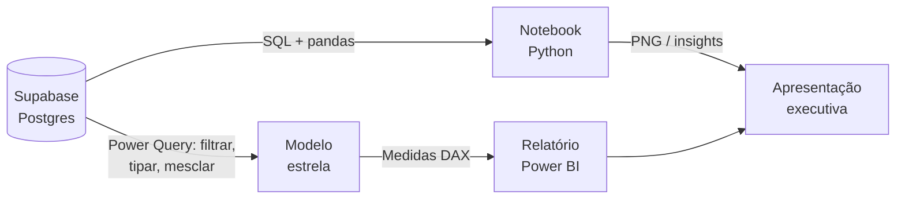

# Fluxo ETL: fonte → modelo → relatório

```mermaid
flowchart LR
  A[(Supabase<br/>Postgres)] -->|Power Query: filtrar,<br/>tipar, mesclar| B[Modelo<br/>estrela]
  B -->|Medidas DAX| C[Relatório<br/>Power BI]
  A -->|SQL + pandas| D[Notebook<br/>Python]
  D -->|PNG / insights| E[Apresentação<br/>executiva]
  C --> E
```
