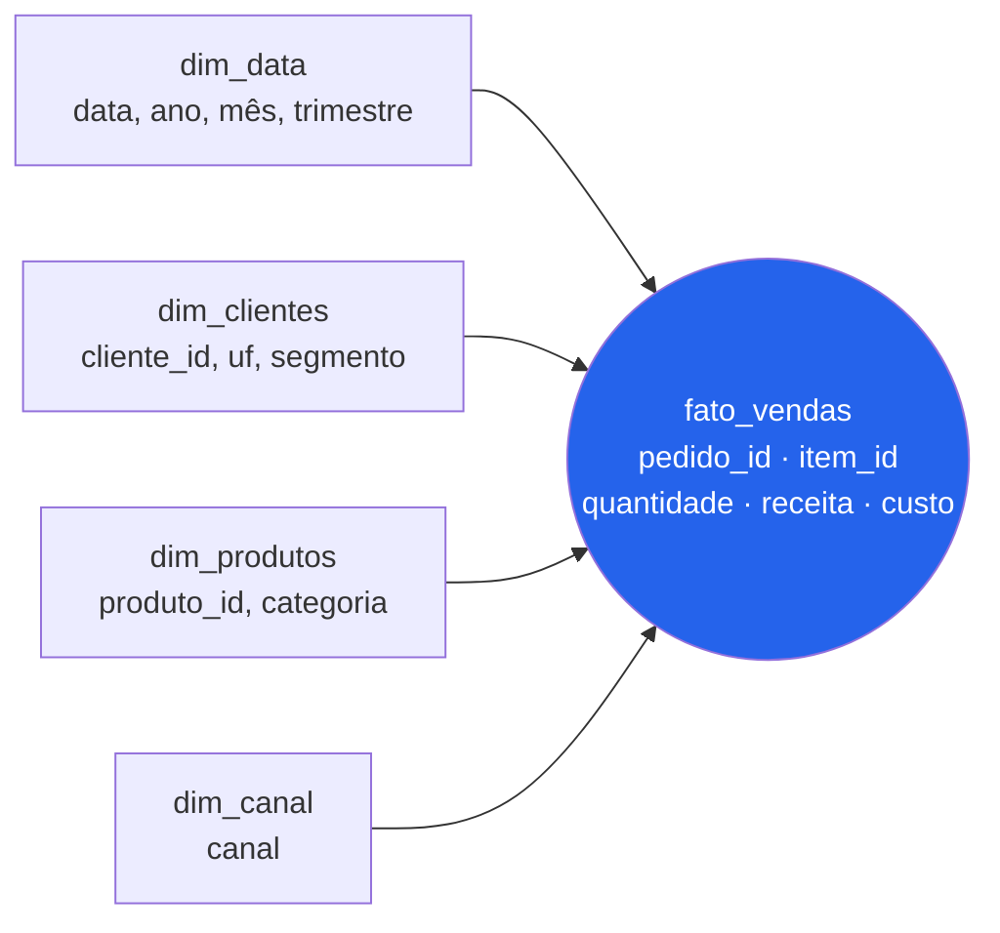

# Modelo estrela para Power BI

```mermaid
flowchart LR
  D[dim_data<br/>data, ano, mês, trimestre] --> F
  C[dim_clientes<br/>cliente_id, uf, segmento] --> F
  P[dim_produtos<br/>produto_id, categoria] --> F
  K[dim_canal<br/>canal] --> F
  F((fato_vendas<br/>pedido_id · item_id<br/>quantidade · receita · custo))
  style F fill:#2563eb,color:#fff
```
